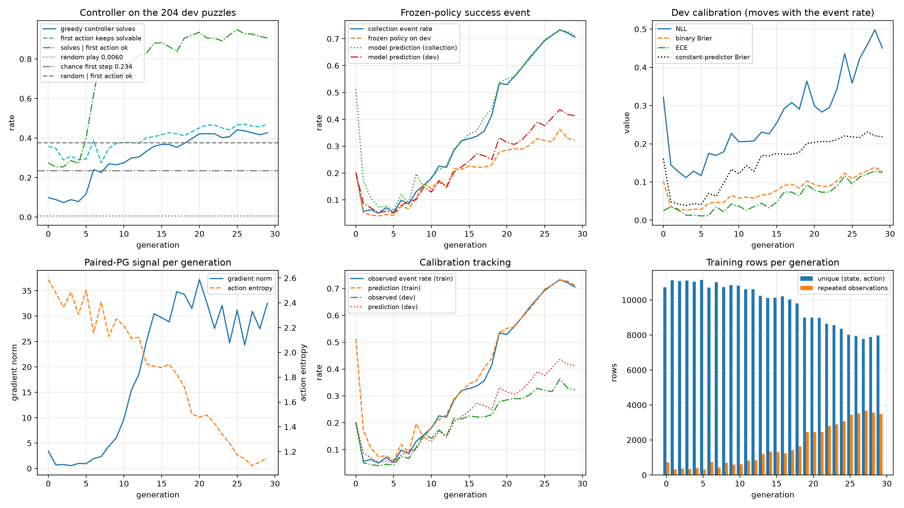
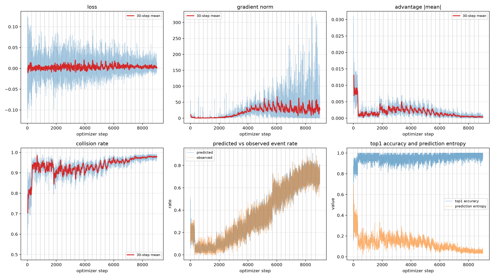

# 24 点 Online RLCD

用 24 点游戏做「决策模型 + 在线 RLCD」实验：模型对每一步的每一个合法动作回答一个
yes/no 问题——**「现在执行这个动作，之后继续由冻结策略接管，最后的值会等于 24 吗？」**——
计算器精确执行每一步运算，标签来自真实 rollout 的观测结果。

## 1. 题库

枚举所有 4 个整数、取值 1–13、非递减排列的牌组，全部用 `Fraction` 精确计算：

| 项目 | 数量 |
| --- | --- |
| 全部牌组 | 1,820 |
| 可解 | 1,362 |
| 不可解 | 458 |

每道题都带元数据：

```json
{"puzzle_id": "3_3_8_8", "numbers": [3, 3, 8, 8], "target": 24, "solvable": true,
 "solution_count": 1, "example_solution": "8 / (3 - 8 / 3)"}
```

`solution_count` 统计**去重后的解**（交换律与相同数字造成的重复会合并），`example_solution`
取最短解；`3_3_8_8` 解唯一，正是 `8 / (3 - 8 / 3)`。

生成命令（约 7 秒，CPU 即可）：

```bash
uv run python scripts/build_24game.py --root data/24game --seed 17
```

产物与划分：

```text
data/24game/
├── train.jsonl          954 道可解题
├── dev.jsonl            204 道可解题
├── test.jsonl           204 道可解题
├── unsolvable.jsonl     458 道不可解题（稳健性集合，不进入训练）
├── oracle_actions.jsonl 每道可解题第一步的每个动作，以及执行后是否仍然可解
└── manifest.json        数字范围、规则、种子、规模、split 哈希、文件哈希、代码版本
```

防泄漏：分组键是排序后的数字多重集 `canonical_key = tuple(sorted(numbers))`。牌组在生成阶段
就已经按非递减形式保存，排列被合并，所以一题一组；`split_puzzles` 用固定种子确定性地按
954/204/204 切开，三个集合互不相交、并集正好是 1,362 道可解题。`verify_manifest` 会在每次
训练开始时校验行数与文件哈希，数据被改动就直接报错。

## 2. 环境

状态是**剩余数字的精确有理数多重集**（排序后的 `Fraction` 元组）。一步从两个数里选一对，
对有序数对施加 `+ - * /`：

- `+` 和 `*` 只提供一次（交换律），相同数值造成的重复动作按键 `op:left:right` 合并；
- `-` 和 `/` 两个方向都提供；
- 除数等于 0 的动作不生成；
- 事件结束条件只有「剩下一个数」，也就是固定三步运算；
- **没有 STOP 动作**；
- 最终值等于 24 记 1，否则记 0。

中间结果允许负数与分数，全程 `Fraction`，不做任何浮点近似。`solvable_after`（执行后是否
仍可解）只用于测试与 oracle 评估，不作为 RLCD 的概率标签。

## 3. 模型输入与输出

当前实验是 **24 点**，它对当前状态的每个合法动作分别回答：执行该动作、随后由冻结策略继续，最终是否会得到 24？

下面是一个完整例子。题目从 `[3, 3, 8, 8]` 开始，已经执行：

```text
1. 8 / 3 = 8/3
2. 3 - 8/3 = 1/3
```

当前只剩 `[1/3, 8]`，还需要一次运算。对于动作 `8 / 1/3 = 24`，会构造两条输入路径。
两条路径内容完全相同，只有最后的候选标签不同：

```text
[STATE]
Target: 24
Remaining: 1/3 8

Steps already taken:
1. 8 / 3 = 8/3
2. 3 - 8/3 = 1/3

[CONTINUATION]
Use the frozen continuation policy.

[ACTION]
8 / 1/3 = 24

[QUESTION]
If this action is performed now and the frozen policy continues, will the final value equal 24 after 1 more operation?

[OPTIONS]
YES
NO

[CANDIDATE]
YES
```

第二条路径的最后两行是：

```text
[CANDIDATE]
NO
```

Qwen 文本 backbone 一次处理两条路径，分别取最后一个非 padding token 的隐藏状态；共享决策头在
`YES/NO` 候选集合上做 attention 和 softmax。示意输出为：

```json
{"action": "8 / 1/3 = 24", "probabilities": {"yes": 0.97, "no": 0.03}}
```

控制器实际会把当前状态的**所有合法动作一次批量送入模型**。这个状态有 6 个动作，即 6 个问题、
每题 2 条候选路径，共 12 条 backbone 输入。内部批结构和一组示意输出如下：

```json
{
  "question_offsets": [0, 2, 4, 6, 8, 10, 12],
  "candidate_ids": ["yes", "no"],
  "action_keys": ["+:1/3:8", "*:1/3:8", "-:1/3:8", "-:8:1/3", "/:1/3:8", "/:8:1/3"],
  "probabilities": [
    {"action": "1/3 + 8 = 25/3",  "yes": 0.01,  "no": 0.99},
    {"action": "1/3 * 8 = 8/3",   "yes": 0.02,  "no": 0.98},
    {"action": "1/3 - 8 = -23/3", "yes": 0.01,  "no": 0.99},
    {"action": "8 - 1/3 = 23/3",  "yes": 0.02,  "no": 0.98},
    {"action": "1/3 / 8 = 1/24",  "yes": 0.001, "no": 0.999},
    {"action": "8 / 1/3 = 24",    "yes": 0.97,  "no": 0.03}
  ]
}
```

以上数值仅用于解释接口。每个动作内部都有 `P(YES)+P(NO)=1`，但不同动作的 `P(YES)` **不需要**
加和为 1，因为它们是六个独立的终局事件问题，而不是 `P(选择某个动作)`。

- greedy 评估选择 `P(YES)` 最大的 `8 / 1/3 = 24`；执行后精确结果为 24，终局标签为 `YES`；
- rollout 数据采集将各动作的 `P(YES)` 归一化成探索分布，再随机选择一个动作；
- 对更早的状态，第一步之后仍有多个动作，最终 `YES/NO` 由整条冻结策略 rollout 的真实结果决定；
- `observed_outcome` 只作为训练目标保存，绝不拼进模型输入。

具体 `policy_id` 也只保存在数据和日志元数据中，不写入 prompt，避免每一代出现从未训练过的任意
ID token。

## 4. 在线 RLCD 循环

每一代：

1. 冻结当前策略，给它一个 `policy_id`（`24game:seed17:g{generation}`）；
2. 从 train 里抽 `puzzles_per_generation` 道题，每题跑 `rollouts_per_puzzle` 次 rollout；
3. 每次 rollout 的每个 `(state, action)` 都保存为独立事件；相同输入出现不同 YES/NO 是估计
   随机成功概率所需的信息，不能去重；
4. 更新前使用同一个 frozen sampled policy 采集独立 dev 事件；
5. 用 paired proper-reward PG 更新模型 `steps_per_generation` 步；
6. 在固定 dev 事件上计算 NLL/Brier/ECE，另行用 greedy controller 报告成功率；
7. learner 无法影响本代 train/dev 标签，校准指标和控制指标不会混用。

**π0 的设定。** 全随机或完全未训练的策略成功率过低，会让标签几乎全是 `NO`。因此第 0 代用
`init_policy: solver_mix`：每一步以 `init_solver_mix` 的概率交给求解器（在「执行后仍可解」的
动作里等概率选一个），否则交给模型。第 1 代起完全由模型自己续玩。求解器只在第 0 代以这个
方式参与数据生成，之后不再出现。

## 5. 运行

```bash
uv run pytest -q                                   # 49 个 CPU 测试
uv run python scripts/build_24game.py               # 生成题库与 manifest
uv run python scripts/smoke_test.py                 # CPU 全流程 smoke（tiny 模型）
sbatch slurm/build.sbatch                           # 需要 Slurm 的等价生成
sbatch slurm/smoke.sbatch                           # 10 步 GPU smoke（runs/smoke_gpu）
sbatch slurm/benchmark.sbatch                       # 批大小 / 显存探测
sbatch slurm/train.sbatch runs/paired_pg configs/train.yaml
sbatch slurm/train.sbatch runs/ce configs/ce.yaml
sbatch slurm/train.sbatch runs/brier configs/brier.yaml
uv run python scripts/evaluate.py --run runs/paired_pg   # 单独跑 test 评估
```

所有 GPU 工作必须在 Slurm 分配内运行（`runtime.require_slurm`）。

## 6. 产物与指标

```text
runs/<name>/
├── resolved_config.{json,yaml}  配置、manifest、题数、git commit
├── training.jsonl               每一步的 loss、梯度范数、校准诊断
├── generation_XXX/
│   ├── trajectories.jsonl       每条轨迹的动作、分布、熵、控制器
│   ├── rows.jsonl               每次 rollout 的独立观测事件，包含 event_id
│   ├── rollout_metrics.json     成功率、YES 比例、平均 P(YES)、动作熵、solver 占比
│   ├── frozen_dev_rows.jsonl / dev_calibration_metrics.json
│   └── dev_controller_metrics.json
├── generations.json / summary.json / checkpoint.pt（8.6 GB，每代覆盖）
└── test_metrics.json / unsolvable_metrics.json / test_report.json
```

指标口径：

- `dev_controller.solved_rate`、`first_action_solvable_rate`：贪心成功率与第一步是否保持可解；
- `yes_rate`：这批行里观测结果为 YES 的比例；
- `binary_brier`、`observed_nll`、`ece_ge_correct`、`mean_prediction_entropy`：校准；
  `observed_brier` 是两类求和的多类 Brier，等于 `binary_brier` 的两倍，报表以 `binary_brier` 为准；
- `mean_action_entropy`：动作分布的熵（上限是 log 动作数），用来观察策略是否退化；
- `oracle_separation`：`P(YES)` 在「执行后仍可解」与「死路」两类动作上的均值差，直接衡量排序
  是否有效；
- `aurc` / risk-coverage：按置信度排序后的准确率曲线。

### 训练曲线



上图按 generation 汇总在线训练结果。左上角显示 greedy controller 在 204 道固定 dev 题上的
成功率、第一步保持可解的比例，以及第一步正确后的条件成功率；中上图比较训练采集策略与冻结
策略在 dev 上的真实成功事件率；右上图给出 NLL、binary Brier 和 ECE，三者都是越低越好。
后期 controller 成功率明显提升，但 train 与 dev 的事件率逐渐分离，同时校准误差上升，说明模型
学会了更有效的动作排序，也出现了过拟合和过度自信。



上图按 optimizer step 展示 paired-PG 的优化信号。原始浅色线是单步统计，红线是 30-step
滑动平均；`gradient norm` 和 `advantage |mean|` 用于观察更新强度，`collision rate` 上升表示
预测采样越来越集中，右下角的熵下降也反映了策略逐渐确定。`loss` 本身不是成功率，是否真正
变强应以 generation 图中的独立 dev controller 成功率为主，并同时检查校准指标。

重新生成两张图：

```bash
uv run python scripts/plot_training.py \
  --run runs/paired_pg_24game_seed17 \
  --out-dir figs
```

## 7. 已知限制

- 458 道不可解题在动作空间内确实无解，模型对它们唯一正确的行为是让 `P(YES)` 保持低位，
  因此它们只用于稳健性检查，不计入成功率。
- 第 0 代的续玩策略有一半由求解器完成，π0 的成功率因此偏高；从第 1 代起标签完全来自模型
  自身策略，跨代比较成功率时要注意这一点。
- 4 个数字固定三步运算，没有 STOP，所以「最终值」只在轨迹结束时存在，事件定义是
  「三步之后的值等于 24」，不存在中途报告答案的情形。
- 校准事件来自 frozen sampled policy；同一条轨迹的三行共享结果，置信区间应按 trajectory 聚类。
